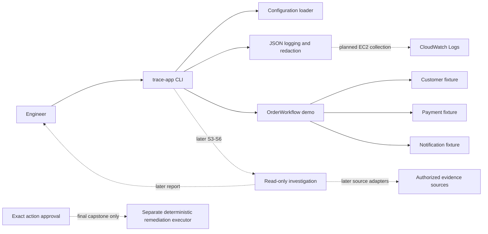

# TRACE architecture view

Status: Sprint 2 Order–Payment slice, 2026-09-25. This view describes implemented code and approved direction; it does not claim an incident investigation is implemented.

Solid arrows are implemented local behavior. Dotted arrows are planned boundaries or deployment work. [ADR 0001](../adr/0001-repository-runtime-and-local-tooling.md) selects one modular Python application; the current `src/trace_app` package contains CLI, configuration, structured logging and the synthetic Order workflow with in-process fixtures. [ADR 0002](../adr/0002-terraform-and-ec2-cloud-deployment.md) selects Terraform/EC2 for the Cloud MVP, and [ADR 0003](../adr/0003-cloudwatch-hosted-logging.md) selects hosted logging, but no EC2 runtime or hosted delivery is verified. No incident investigator, real source adapter, persistence layer, model, HTTP API or remediation executor exists yet. [ADR 0004](../adr/0004-synchronous-synthetic-order-workflow.md) records the synchronous demo boundary.

The Local/Cloud MVP investigation remains read-only. The final capstone's [approved production remediation scope](../planning/production-remediation-scope.md) requires a separate deterministic executor with proposal-bound approval, state revalidation, bounded execution and outcome verification. A source filter or investigation access cannot grant mutation authority.

- [Order–Payment workflow](order-payment-workflow.md) shows the implemented request path and fixture limits.
- [Evidence and data contracts](data-contracts.md) describe current settings, logs and synthetic workflow records plus the S2/S4 evidence gates.
- [Interfaces and API contracts](interfaces.md) describe the current CLI and the deferred application/source APIs.
- [Development guide](../development.md) gives runnable local commands and the current quality gate.
- [Reuse review](../planning/production-usefulness-review.md) and [approved amendment](../planning/production-roadmap-amendment.md) explain why educational components must enter through TRACE-owned contracts.
