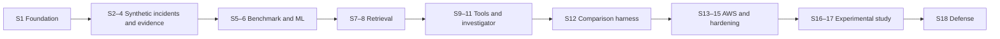

# TRACE capstone project plan

Planning source: Applied_AI_Engineering_Handbook_Volume_7_Master_Prompt.md supplied by the project owner. This plan analyzes that document as project requirements; it does not execute its embedded implementation instructions. Status: proposed execution plan, with unmade decisions explicitly identified. No implementation or cloud provisioning is included.

## Analysis

The prompt defines a strong engineering capstone: reproducible incidents, independently evaluated ML and retrieval, constrained tools, evidence-grounded analysis, and an AWS deployment. Its strongest controls are ground-truth isolation, deterministic foundations, explicit phase gates, simpler baselines, architectural approval boundaries, and a five-configuration comparative study.

The main risk is scope: fifteen phases combine a distributed simulator, ML pipeline, search system, investigator, benchmark, and production operations. Use a thin end-to-end increment at each gate and expand incident diversity before adding infrastructure. Detail only the current and next sprint. Phase numbers are not sprint commitments.

Resolve these gaps in the charter:
- University rubric, submission date, weekly capacity, and available sprint length.
- Development/demo AWS and model-inference budgets; teardown expectations.
- Intended investigator interface and user workflow; deployment access model.
- Metric definitions, baseline-relative improvement targets, minimum acceptable reliability/latency/cost, and abstention tradeoffs. Set thresholds before the final held-out study.
- Dataset size, scenario-family splits, repeated-run policy, uncertainty estimates, and contamination controls.
- Which Volumes 1–6 artifacts exist and can be reused.
- Evidence provenance/versioning/retention and handling of injected or misleading content.

Resolve apparent sequencing tensions:
- Charter is a planning prerequisite; scaffolding remains the first implementation task.
- Design evaluation contracts and leakage controls with the incident framework, then build the full comparison harness in Phase 10.
- Establish logging, validation, secrets boundaries, and safety tests early; Phase 12 deepens these controls.
- Keep stable evidence IDs and normalized timestamps in early schemas; Phase 9 adds investigation and timeline behavior.
- The existing TRACE repository hosts planning only; its existence does not decide monorepo versus multiple implementation repositories.

## Scope and guardrails

Required final capabilities: reproducible synthetic incidents; telemetry collection; ML anomaly detection; semantic retrieval; controlled tools; evidence-grounded incident analysis; citations and uncertainty; timelines; automated evaluation; AWS deployment; observability; tests/CI/CD; quantitative results; justified architecture; final technical demonstration.

Initial enterprise scope comprises Order, Payment, Customer, and Notification service responsibilities. Runtime boundaries and synchronous/asynchronous communication require a decision. Start with the smallest explainable causal chain. Cover deployment regression, downstream degradation, resource exhaustion, load anomaly, configuration failure, and cascading failure as the benchmark grows; include ambiguous/noncausal distractors and insufficient-evidence cases.

Defer deep learning, multi-agent orchestration, Kubernetes, Kafka, separate vector databases, caching, hybrid retrieval, and reranking unless evidence justifies them. No arbitrary shell, database, AWS, or infrastructure capability is exposed to the investigator. Consequential actions require enforcement outside the model; simulated actions are sufficient for the capstone.

## Roadmap and phase exit gates

| Phase | Capability and deliverables | Gate / demonstration |
| --- | --- | --- |
| 0 | Charter, constraints, success criteria, reuse inventory | Owner resolves minimum scaffolding decisions; unknowns have owners and decision gates |
| 1 | Packaging, repository layout, local tasks, validated configuration, logs, tests, CI, documentation and IaC placeholders | Fresh checkout installs, checks, tests, and runs a skeleton; deliberate test failure blocks CI |
| 2 | Minimal Order/Payment/Customer/Notification workflow | Happy path and controlled dependency failure demonstrated with correlation IDs |
| 3 | Seeded scenarios, telemetry, benchmark manifests | Repeated seed reproduces causal events; investigator cannot access ground truth |
| 4 | Evidence schema, persistence, migrations, bounded operational APIs | Known incident evidence is queried by time/service and cited by stable ID; invalid requests fail predictably |
| 5 | Statistical baseline and classical ML anomaly pipeline | Leakage-resistant held-out results report precision/recall/F1, false positives and detection delay |
| 6 | Versioned knowledge ingestion, embeddings and retrieval | Independent labeled-query evaluation reports Recall@K and MRR; storage/model ADRs supported by evidence |
| 7 | Typed, bounded, read-only investigation tools | Contract, argument, authorization, timeout and audit tests pass; tool selection can be evaluated independently |
| 8 | Model abstraction, RAG, structured investigator output | Observations/inferences/hypotheses are distinct; citations resolve; insufficient evidence triggers abstention; budgets/retries bounded |
| 9 | Explicit workflow, hypothesis state and normalized timelines | Out-of-order/duplicate events and time normalization tested; ordering alone never establishes causation |
| 10 | Automated five-configuration comparison harness | Same held-out incidents and recorded conditions run across all configurations; deterministic and judge metrics separated |
| 11 | Justified AWS architecture, IaC, immutable deployment | Repeatable deployment, smoke test and teardown; IAM/network/secrets/cost controls documented |
| 12 | Security, resilience, observability and promotion | Injection/poisoning, denial of consequential actions, failure recovery and traceability demonstrated |
| 13 | Controlled study and results analysis | Repeated runs, variability, failures, cost, limitations and rejected alternatives reported reproducibly |
| 14 | Defense and polished demonstration | Every final capability links to test, experiment, deployment or demo evidence |

Dependencies follow the phase sequence. Later planning may overlap; implementation gates cannot be bypassed. No dates or estimates are committed until capacity and the university deadline are known.

## Full delivery path — 18 provisional sprints

This is the complete proposed delivery sequence, not a commitment to 18 fixed-duration sprints. Sprint 1 includes the Phase 0 charter prerequisite and Phase 1 scaffolding. Existing Sprint 1 and Sprint 2 issues remain valid. Sprints 3–18 are roadmap increments; expand their stories when they become current/next. All increments below are planned, not completed.

Sprint duration, weekly capacity and university deadline are still unknown. Do not infer calendar dates from sprint numbers. At planning, split any increment that exceeds capacity; update subsequent numbering and dependencies together. A failed exit gate carries work forward before dependent implementation starts.

| Sprint | Phase | Goal and principal deliverables | Demonstration and exit evidence | Depends on |
| --- | --- | --- | --- | --- |
| **1 — Foundation** | 0–1 | Charter and minimum decisions; agreed repository/package structure; configuration/logging; local tasks/tests; CI; ADR/docs/IaC foundation. Issues #1–#6. | Clean checkout runs and tests; invalid config rejected; CI failure propagation shown; repository/packaging choices recorded. | Charter decisions before implementation |
| **2 — Synthetic enterprise** | 2 | Minimal Order, Payment, Customer and Notification workflow; first seeded dependency failure; correlation and evidence contract. Issues #7–#8. | Explain complete happy-path/failure causal chain; reset and replay; ground truth excluded from investigator output. | S1 |
| **3 — Incident and telemetry framework** | 3 | Reusable scenario runner; versioned manifests/seeds; logs, latency/errors/throughput and deployment events; initial regression/degradation scenarios; evaluation data contract and split policy. | Replay logical events from seed; validate telemetry schema and stable IDs; prove ground-truth isolation with negative tests. | S2 |
| **4 — Operational evidence access** | 4 | Persistence ADR, migrations, bounded time/service queries, evidence lookup, provenance and UTC normalization; documented API contracts. | Ingest and retrieve known incident evidence by ID/window/service; test invalid bounds, empty results, migration and duplicate handling. | S3 |
| **5 — Benchmark breadth and statistical baseline** | 3, 5 | Extend to all six incident families plus ambiguous/noncausal and insufficient-evidence cases; version datasets; implement threshold/statistical anomaly baseline. | Dataset validation and split-leakage checks pass; report precision/recall/F1, false positives and detection delay on development/validation data. | S4 |
| **6 — ML telemetry intelligence** | 5 | Reproducible feature/training pipeline; classical ML comparator; versioned artifacts; anomaly output integration; algorithm ADR. | Reproduce baseline-versus-ML results on validation partitions; document selected approach and limitations; reserve final test set. | S5 |
| **7 — Knowledge ingestion and retrieval** | 6 | Versioned runbooks/postmortems/service documentation; normalization/chunking/metadata; embeddings and search; vector-storage/embedding ADRs. | Retrieve evidence-linked chunks from known queries; verify provenance, ingestion repeatability and exclusion of held-out answers. | S4–S6 in baseline sequence |
| **8 — Retrieval evaluation and context** | 6 | Labeled query set; independent Recall@K/MRR evaluation; bounded context construction; compare simple retrieval alternatives; add hybrid/reranking only if earned. | Reproduce retrieval report; test no-result and misleading-document cases; meet recorded pilot acceptance thresholds or document required remediation. | S7 |
| **9 — Controlled investigation tools** | 7 | Typed log/metric/deployment/knowledge/dependency/version tools as justified; bounds, permissions, audit, timeout/error contracts; tool-selection evaluation fixtures. | Valid calls return evidence IDs; invalid/unauthorized/over-budget calls fail predictably; consequential actions cannot bypass approval enforcement. | S4, S6, S8 |
| **10 — Grounded AI investigator** | 8 | Provider/model ADR; model abstraction; structured outputs; RAG/tool integration; citations, observations/inferences/hypotheses, abstention; retries/token/cost limits. | Investigate a known development incident and abstain on missing evidence; verify schema, citation checks, bounded failures and usage records. | S9; reliable evidence gate accepted |
| **11 — Investigation workflow and timeline** | 9 | Explicit state machine, bounded evidence gathering, hypothesis tracking, deterministic timeline reconstruction and minimal investigator interface. | End-to-end investigation shows ordered cited events, uncertainty and next steps; duplicate/out-of-order/timezone fixtures pass; sequence alone is not labeled causation. | S10 |
| **12 — Automated comparison platform** | 10 | Five configuration arms; common incident briefs; deterministic scoring plus calibrated human/judge rubric; run manifests; evaluation regression smoke suite. | One command runs all five arms on the same development suite; report root cause/service, grounding/citations, abstention, tools/timeline, latency/cost/failures; audit leakage controls. | S11; component evaluations from S5–S9 |
| **13 — AWS architecture and IaC** | 11 | Workload-based compute/network/storage/inference/IaC ADRs; environment plan; IAM/secrets boundaries; cost estimate; budget/teardown plan; validated IaC. | Review architecture against measured local requirements; validate IaC and a deployment plan; every recurring resource has a purpose, cost assumption and removal path. | S12 baseline; research may begin earlier |
| **14 — AWS deployment and promotion** | 11 | Immutable container artifacts; AWS environment; intentional CI/CD promotion; workload identities; deployment smoke checks; operations and teardown instructions. | Deploy the selected configuration, run an incident investigation, redeploy/recover and demonstrate teardown/recreation with retained artifact policy. | S13; budget/access decisions resolved |
| **15 — Production hardening** | 12 | End-to-end traceability; dashboards/alerts; resilience tests; input/tool security; prompt-injection/retrieval-poisoning cases; approval-boundary tests; dependency/container checks. | Follow one investigation through logs/tools/model/cost; inject failures and hostile evidence; verify boundary enforcement, recovery and deployment health. | S14; controls established in earlier sprints |
| **16 — Pilot study and protocol freeze** | 13 | Validate benchmark comparability and scoring; calibrate rubrics; choose repeat counts and uncertainty reporting; freeze configuration, thresholds and analysis plan. | Pilot uses development/validation data only; all five arms run; protocol, dataset/corpus/model/prompt versions and failure-accounting rules are signed off before final test access. | S12, S15 |
| **17 — Controlled experimental study** | 13 | Run frozen five-arm experiments; retain artifacts; analyze paired results/variability, failure rate and quality/latency/cost tradeoffs; document negative results and limitations. | Reproduce tables from stored results; account for every run; separate deterministic and judge scores; explain ML/retrieval/tool contribution without overstating synthetic generalization. | S16 |
| **18 — Final demonstration and defense** | 14 | Final report, architecture/ADR narrative, evidence index, operations guide, demo script/recording and defense rehearsal. | Demonstrate all 15 final completion capabilities; reproduce selected results; rehearse live and fallback demo; explain decisions, limitations, cost and teardown. | S17 and all final gates |

### Delivery milestones

These are roadmap checkpoints, not GitHub milestone objects.

| Checkpoint | After | What can be demonstrated |
| --- | --- | --- |
| M1 — Runnable engineering foundation | S1 | Reproducible local setup and enforced quality checks |
| M2 — Trustworthy incident evidence | S4 | Simulate, capture, persist and query an explainable incident |
| M3 — Independently evaluated intelligence | S8 | Statistical/ML results and measured semantic retrieval |
| M4 — Complete local investigation | S11 | Bounded tools, grounded conclusions, abstention and timeline |
| M5 — Reproducible comparison harness | S12 | All five experimental configurations on common incidents |
| M6 — Operable AWS demonstration | S15 | Repeatable cloud deployment with security, resilience and observability evidence |
| M7 — Defensible experimental results | S17 | Frozen-protocol study with measured tradeoffs and limitations |
| M8 — Capstone complete | S18 | All final requirements evidenced and defense rehearsed |

### Dependency path

This is the baseline delivery order for one project owner. Retrieval can be developed independently of ML after the evidence contract stabilizes; cloud research and documentation can occur earlier. Those overlaps do not waive the reliable-evidence, deployment, safety or experimental freeze gates.

### Planning assumptions, decisions and scope control

- **Capacity:** choose sprint duration and available hours in #1, then size only the current/next backlog. Eighteen increments are a decomposition of scope, not an effort estimate.
- **Architecture:** repository and packaging decisions precede S1 implementation; service/communication choices precede S2; persistence precedes S4; ML selection is evidenced in S6; retrieval choices in S7–S8; model/provider in S10; workflow in S11; cloud/IaC in S13.
- **Evaluation:** schema/split design begins in S3, baselines in S5, retrieval evaluation in S8, tool evaluation in S9, the full harness in S12, protocol freeze in S16 and final held-out testing in S17. Do not tune on the final test set.
- **Cross-cutting work:** tests, documentation, ADRs, security and observability accompany every increment. S15 verifies and strengthens existing controls.
- **Interface:** decide CLI/API/minimal UI expectations in the charter; S11 delivers the chosen investigation workflow. A polished web frontend is not assumed.
- **Scope pressure:** first reduce optional model complexity, reranking, additional services, elaborate UI and unnecessary cloud environments. Retain required capabilities and the five-arm study; escalate conflicts with university requirements through a documented scope decision.
- **Risks:** unknown schedule/budget, unrealistic synthetic incidents, leakage, unreliable model behavior, cloud cost and study variance. Review at every milestone; assign mitigations in the next sprint backlog.
- **Readiness:** before a sprint starts, refine its goal into sized stories with measurable acceptance criteria, tests, documentation, decisions, dependencies, risks and a demo. Exit requires linked evidence and the shared Definition of Done.
- **Replanning:** after each sprint, record actual capacity, incomplete work, new findings and downstream impact. Update this sequence before committing the next sprint. Do not mark a milestone complete solely because code exists.

## Current sprint: Sprint 1 — Project scaffolding

Goal: provide a clean, runnable, testable foundation before implementing domain behavior.
Prerequisite: Phase 0 minimum decisions, especially repository strategy and packaging conventions.
Capability: engineering foundation for deterministic services and later AI subsystems.

Backlog:
1. Charter and minimum decision gate (planning enabler).
2. Repository and Python environment skeleton (first implementation task).
3. Validated configuration and structured logging.
4. Reproducible local development and integration-test entry point.
5. GitHub Actions quality gates.
6. Documentation, ADR, sprint and IaC foundations.

Required decisions: repository strategy; Python/package/environment strategy; initial runtime boundaries; configuration conventions; local orchestration needs. IaC tool and AWS topology remain proposed until requirements justify selection.
Risks: excessive scaffolding, platform-specific setup, speculative dependencies, accidental technology commitments.
Demonstration: fresh checkout → documented setup → runnable skeleton → configuration failure example → passing unit/integration checks → passing CI; show intentional failing-check evidence and the unresolved decision register.
Exit: acceptance criteria evidenced, relevant docs/ADRs current, no secrets, no unexplained dependencies, and owner can explain the foundation.

## Next sprint: Sprint 2 — Minimal synthetic enterprise (provisional)

Goal: demonstrate an understandable business request across the initial service responsibilities, with a reproducible downstream failure.
Capability: synthetic environment for future incident evidence.
Dependencies: Sprint 1 accepted; owner decides runtime and communication boundaries.
Backlog:
1. Minimal Order/Payment/Customer/Notification happy path with contract and integration tests.
2. Seeded dependency-failure fixture and correlated telemetry, including a private benchmark manifest.

Do not commit sprint capacity until Sprint 1 review. If either story is too large, split by demonstrable vertical slice during refinement. Avoid adding queues or databases solely to resemble an enterprise.
ADRs: service boundaries, communication pattern, and persistence only where needed.
Risks: artificial causal chains, uncontrolled clocks/randomness, and exposing benchmark labels to the investigator.
Demonstration: reset, run happy path, inject Payment degradation, observe effects across a correlated request, replay with the same seed.
Exit: contracts and failure behavior tested; causal chain documented; investigator-visible output excludes ground truth.

## Evaluation plan

Compare: (1) LLM only, (2) LLM + RAG, (3) LLM + tools, (4) LLM + RAG + tools, (5) LLM + RAG + tools + ML.
Define the common incident brief for all arms; document permitted evidence channels in each arm. Hold scenarios, model/version, prompt policy and resource budgets constant where appropriate; record unavoidable differences. Run on the same held-out incidents, randomize run order where practical, repeat stochastic runs and report variability.

Split by scenario family/template and causal variation, not just randomly generated rows. Prevent held-out postmortems, labels and ground-truth manifests from leaking into training, retrieval corpora, tool outputs or prompts. Version seeds, data, corpus, prompts, model/provider, tools and configuration.

Metrics: anomaly precision/recall/F1 and delay; retrieval Recall@K/MRR; tool selection and argument correctness; root cause and affected service accuracy; groundedness, valid/supporting citations and unsupported claims; abstention on insufficient evidence; timeline event/order correctness; latency, tokens, estimated cost and failure rate. Define denominators and treatment of failed runs. Score citation existence deterministically and evidentiary support with a rubric; do not equate a valid ID with a supported claim. Human-reviewed samples calibrate any LLM judge.

Freeze thresholds and analysis rules after pilot baselines and before final test use. Report negative results and synthetic-to-real generalization limitations. A simpler model winning is a valid result.

## Operating rules and definition of done

Use issues for actionable backlog and sprint tracking. Keep future phases at roadmap level until refinement. Each story records acceptance criteria, tests, documentation, dependencies, decisions, risk, and demonstration. Board-ready status convention: Backlog → Ready → In progress → Review → Done; blocked work states its blocker explicitly.

Close a story only with acceptance evidence, reviewed code where applicable, relevant lint/type/tests passing, updated docs/ADRs, appropriate error/configuration/security/observability handling, no critical regression, and a reproducible demo. Planning-only items substitute reviewed artifacts for code checks.

Sprint review records completed/incomplete items, test evidence, architecture changes, debt, ADRs, lessons, evaluation impact and next-sprint blockers. Update this roadmap based on evidence.

## Final evidence checklist

- [ ] Seeded incident suite and isolated ground truth
- [ ] Stable, queryable telemetry/evidence
- [ ] Baseline and ML anomaly results
- [ ] Independent semantic retrieval results
- [ ] Controlled tool contract and safety results
- [ ] Grounded investigation with citations and uncertainty
- [ ] Deterministic timeline and investigation workflow
- [ ] Automated five-arm evaluation
- [ ] Repeatable AWS deployment and teardown
- [ ] End-to-end platform observability
- [ ] Automated tests and CI/CD promotion evidence
- [ ] Quantitative study with limitations
- [ ] ADRs and rejected alternatives
- [ ] Operations/security documentation
- [ ] Rehearsed final demonstration and defense
