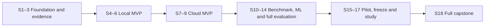

# TRACE capstone project plan — MVP-first delivery

## Approved planning direction

The project owner approved an MVP-first revision on September 22, 2026. This supersedes the previous strictly sequential 18-sprint roadmap. The master prompt remains the source for final capstone capabilities; this approved revision changes delivery order and initial scope. No implementation or cloud provisioning is performed by this planning update.

**Product promise:** evidence-supported incident diagnosis. Reports distinguish observations, most likely explanation and supporting evidence, competing hypotheses, missing evidence, uncertainty and next useful check. TRACE does not promise that temporal correlation establishes root cause.

Build one complete thin investigation before broad subsystem expansion. Preserve bottom-up dependencies inside that slice: deterministic evidence → bounded queries/tools → grounded investigation → automated evaluation. ML is required for the final capstone but is not a prerequisite for the first useful investigator.

## Approved production-usefulness amendment — September 23, 2026

The owner approved the [implementation review](production-usefulness-review.md) and [production roadmap amendment](production-roadmap-amendment.md), including all recommendations. The amendment is part of this plan: its sprint additions and stronger acceptance gates apply to the delivery table below. The MVP-first order and five-arm capstone requirements remain. Resize affected increments against actual capacity; no additional calendar commitments are implied.

Use this TRACE repository for a modular Python application with TRACE-owned contracts and reproducibly versioned reuse. Preserve the educational projects as references. Volume 5 and Volume 6 are design-only inputs whose capabilities will be implemented within TRACE, not prerequisites that already exist. Reuse Volume 4 retrieval through adapters, retain the Volume 2 classical pipeline as an evaluated candidate, and keep Volume 3 deep learning optional pending measured benefit. Replace simulated investigation, heuristic causal confidence and development fallback behavior before production reuse.

**Independent Operational Pilot gate:** authorized real or sanitized historical incident replay followed by read-only shadow use with a named operator/team; comparison with their current workflow and a deterministic evidence bundle; predeclared quality, latency and cost criteria; access isolation, recoverability, support ownership and operator feedback. Local MVP, Cloud MVP and Full Capstone acceptance do not substitute for this gate. Access unavailable means operational usefulness remains unvalidated. The operational pilot is distinct from S15's validation-only experimental pilot and may overlap releases once its prerequisites are met.

Bring source-neutral provenance and time/access semantics into S2; durable investigation state and failure-aware scoring into S3; real-source retrieval contracts, freshness/revocation and authorization across evidence reads/citations into S4; bounded model/tool execution and usage telemetry into S5. S6 adds human-reviewed support cases and the deterministic evidence-bundle reference. Before hosted investigations, prove recoverable dispatch, worker crash/duplicate handling, restore, retention/deletion and rollout rollback. ML evaluation must measure real-base-rate alert burden, detection delay and downstream benefit; detector failure must preserve the evidence-only workflow.

Repository strategy is approved; packaging/runtime specifics, pilot user and authorized sources, workload/budget thresholds, capacity and university constraints still need recorded decisions. Offline contract/replay work can proceed without credentials; live-provider and operational-pilot acceptance cannot be satisfied by stubs. Existing backlog acceptance criteria are amended in place, and no story is completed by this planning approval.

## Three releases and acceptance gates

| Release | Target | Required scope and acceptance evidence |
| --- | --- | --- |
| **Local MVP** | End of S6 | Reproducible Order → Payment incidents; small semantic corpus; bounded read-only tools; explicit workflow; cited structured diagnosis; deterministic timeline; abstention; automated end-to-end development scoring; passing tests and documented setup. |
| **Cloud MVP** | End of S9 | The same workflow deployed repeatably to an initial EC2 target provisioned with Terraform and intentional CI/CD promotion, with access controls, workload identities, secrets handling, observability, cost controls, failure recovery and verified teardown/recreation. |
| **Full capstone** | End of S18 | Broader benchmark, evaluated ML and retrieval, all five comparison arms, hardened operations/security, frozen-protocol quantitative study, architectural justification and final defense; all 15 final capabilities retained, plus verified authorized production remediation. |

Release thresholds for quality, reliability, latency and cost must be recorded before the relevant acceptance run. University rubric, deadline, weekly capacity, sprint duration and cloud/model budgets remain charter decisions; no dates or numerical quality targets are invented here. Local MVP acceptance is not evidence of full capstone completion.

## MVP scope and deliberate deferrals

| Area | Local/cloud MVP | Full capstone or conditional expansion |
| --- | --- | --- |
| Enterprise | Order → Payment runtime path; Customer/Notification lightweight fixtures | Expand service behavior or independent deployment only if scenario requirements justify it |
| Incidents | Deployment regression, dependency degradation, insufficient evidence; include unrelated deployment distractor | Six families: regression, degradation, exhaustion, load anomaly, configuration failure, cascading failure; ambiguous and adversarial cases |
| Evidence | Structured logs, latency/error metrics, deployments, stable IDs, provenance and UTC timestamps | Queue/resource signals and richer dependency graph as needed |
| Retrieval | Small curated versioned corpus, labeled queries, embeddings and measured semantic search | Broader ingestion; hybrid/reranking only if measured benefit |
| Tools | Bounded log, metric, deployment and knowledge queries | Dependency/version tools only for identified investigation gaps |
| Investigator | Explicit bounded workflow, structured report, deterministic timeline, CLI default | Minimal web view only if necessary; richer state/hypotheses when justified |
| ML | Deferred from MVP; statistical summaries may support evidence inspection | Anomaly-window/signal prioritization; statistical versus classical ML comparison and downstream ablation |
| Actions | Read-only investigation and recommendations; no operational execution tool | At least one real, explicitly approved production remediation through a separate deterministic executor; staging validation precedes production |
| AWS | Terraform-managed EC2 deployment for the initial demo, budget/access controls and teardown | Select the exact topology, instance, network, state backend, and app rollout from measured requirements; add services only with evidence |

Do not introduce deep learning, multi-agent orchestration, Kubernetes, Kafka, a separate vector database, caching or an elaborate dashboard without evidence. Implementation uses the TRACE repository and a modular Python application. Packaging/runtime details, persistence and model/provider choices require justified ADRs. Terraform and EC2 are selected for the Cloud MVP direction; exact AWS topology and application-artifact release to EC2 remain S7/S8 design decisions in [ADR 0002](../adr/0002-terraform-and-ec2-cloud-deployment.md). Existing lexical/semantic/hybrid retrieval is reused as a measured baseline; new reranking or infrastructure still needs evidence.

## Full delivery path — 18 provisional sprints

These are scope increments, not time estimates. Only current/next sprint stories are detailed. Re-size and split increments using actual capacity; update dependencies and release gates together. All listed work is planned, not completed.

| Sprint | Goal | Principal deliverables | Demo / exit gate | Dependencies |
| --- | --- | --- | --- | --- |
| 1 | Foundation | Charter, reuse inventory, package/runtime decisions, skeleton, configuration/logging, local tests and CI; #1–#6. | Clean checkout runs; checks fail correctly; decisions and setup documented. | Charter before implementation |
| 2 | Minimal synthetic workflow | Order → Payment runtime path; Customer/Notification fixtures; first seeded degradation; evidence IDs and evaluator-only ground truth; #7–#8. | Replay happy/failure paths; validate contracts, correlation and ground-truth isolation. | S1 |
| 3 | Reliable evidence and early scoring | Bounded log/metric/deployment queries and persistence; regression/degradation/insufficient-evidence fixtures; noncausal deployment distractor; UTC timeline; development scoring runner. | Query evidence by ID/window/service; reproducible manifests; deterministic timeline and scorer fixtures pass; reserve final-test data. | S2 |
| 4 | Small retrieval corpus and controlled tools | Curated versioned knowledge, labeled retrieval queries and Recall@K/MRR; typed bounded log/metric/deployment/knowledge tools; timeout/audit/authorization contracts. | Known queries retrieve supporting documents; invalid tool calls rejected; no operational write capability. | S3 |
| 5 | First complete investigator | Provider ADR, explicit bounded workflow, structured report, citations, alternatives, missing evidence, abstention, deterministic timeline; CLI by default; automated end-to-end scoring begins now. | Run an incident from evidence to scored report; validate citation IDs and sampled support; test timeout, malformed output and insufficient evidence; record usage/cost. | S4 |
| 6 | Local MVP acceptance | Stabilize development suite, LLM-only reference versus integrated RAG/tools, scoring rubrics and failure accounting; document minimum release thresholds before acceptance runs. | One command reproduces suite and reports diagnosis, unsupported claims, citations, abstention, timeline, latency/cost/failures; meet documented thresholds; critical boundary tests pass. | S5 |
| 7 | Terraform and EC2 deployment design | Design a minimal Terraform-managed EC2 target from measured MVP workload; decide region, AMI/instance sizing, network, state backend, identity/secrets, access, budget, retention and teardown. | Reviewable plan/configuration with cost assumptions, least-privilege access and teardown; no unnecessary environment duplication or resources applied. | Local MVP gate |
| 8 | EC2 application deployment and CI/CD | Automate immutable application release to the Terraform-managed EC2 target; select a reproducible image/bootstrap or other deployment mechanism, intentional promotion, workload identity, access controls, smoke tests, minimal end-to-end logs/metrics and cost tracking. | Deploy and run local-MVP scenarios on EC2; confirm access isolation, evidence traceability, rollback/recovery and CI/CD smoke checks. | S7 |
| 9 | Cloud MVP acceptance | Failure recovery, prompt injection/poisoning checks, resource budgets, operational guide and teardown/recreation. | Demonstrate investigation, failed-request recovery, enforced read-only tools and resource removal/recreation; cloud release criteria evidenced. | S8 |
| 10 | Benchmark breadth and statistical baseline | All six incident families, matched symptoms with different causes, noncausal distractors, missing telemetry; versioned splits; threshold/statistical detector. | Validate scenarios/leakage; report detection precision/recall/F1, false positives and delay on development/validation data. | Cloud MVP gate |
| 11 | ML contribution | Classical ML pipeline to prioritize anomalous windows/signals; reproducible features/artifacts; compare against statistical baseline. | Measure whether ML improves diagnosis or reduces tool calls/latency/cost; retain negative results and justify selection; never treat anomaly as causal proof. | S10 |
| 12 | Retrieval and tool refinement | Broader curated corpus and labeled queries; independent tool selection/argument evaluation; justify retrieval changes; expand tools only for measured gaps. | Reproduce retrieval and tool reports; regression suite passes; optional hybrid search/reranking earns inclusion experimentally. | S11 baseline; technical prerequisites S4–S6 |
| 13 | Full five-arm comparison harness | LLM only; RAG; tools; RAG+tools; RAG+tools+ML. Shared incident briefs, budgets, recorded conditions, deterministic scoring and calibrated judge/human rubric. | Run all five arms on common development incidents; account for failed runs and reproduce scores from artifacts. | S11–S12 |
| 14 | Capstone hardening and coverage | Broader resilience/observability/security regressions, operations docs; real remediation adapter and deterministic approval/execution boundary validated in staging; enrich workflow only where evidence warrants. | Actual staging mutation is verified; unauthorized/stale approval and duplicate/crash cases pass; hostile evidence cannot grant permissions. | S13 |
| 15 | Pilot and protocol preparation | Validation-only AI pilot and rubric calibration; separate production-remediation readiness review and owner-supervised rollout; identify remaining completeness gaps. | Five-arm pilot is reproducible; sample scoring reviewed; final test set untouched; planned report tables and comparisons defined. | S14 |
| 16 | Protocol freeze and readiness gate | Freeze datasets, corpus, model/prompt/tool/config versions, budgets, thresholds and statistical analysis; complete final capability evidence review. | Every required capability, including verified authorized production remediation, has evidence or a blocking item; protocol approved before final test access; no unresolved critical blockers. | S15 |
| 17 | Controlled experimental study | Run frozen five-arm study; analyze paired results/variability, failures, quality/latency/cost tradeoffs and ML benefit. | Reproduce tables from saved artifacts; separate unseen-variant and unseen-family results; disclose negative results and synthetic limitations. | S16 |
| 18 | Final demonstration and defense | Report, architecture/ADRs, evidence index, operations guide, demo recording/fallback and defense rehearsal. | All 15 final capabilities evidenced; selected results reproduced; decisions, limitations and teardown explained. | S17 |

### Delivery path

The earlier master-prompt phases are capability categories rather than mandatory implementation order under this approved revision. Reliable evidence is still mandatory before LLM integration. The complete ML subsystem and five-arm study are deferred beyond the MVP, not removed.

## Current and next sprint plans

### Sprint 1 — Foundation
Goal: clean runnable/testable foundation, with scaffolding the first implementation task.
Backlog: charter/minimum decisions (#1), repository/environment skeleton (#2), configuration/logging (#3), local tasks/integration foundation (#4), CI (#5), ADR/docs/IaC foundations (#6).
Dependencies: record minimum charter and package/runtime decisions for the approved TRACE repository before skeleton implementation.
Tests: clean setup, meaningful smoke/integration checks, invalid configuration/redaction checks and deliberate CI failure evidence.
Docs/decisions: charter, reuse inventory, repository/package ADRs, setup, local commands, review and IaC templates.
Risks: excessive scaffolding and speculative infrastructure.
Demo/gate: fresh checkout runs/checks/tests; CI and docs prove repeatability; no AWS provisioning or domain behavior before the foundation.

### Sprint 2 — Minimal synthetic workflow
Goal: explain the causal chain in an Order → Payment request and reproduce one downstream failure.
Backlog: narrowed happy path (#7), seeded dependency failure/evidence contract (#8).
Customer and Notification are fixtures, not required independently running services.
Dependencies: S1 accepted; owner records service/communication choices.
Tests: request contracts, correlation propagation, happy/failure integration, replay/reset, evidence schema, deterministic timestamps and ground-truth exclusion.
Docs/decisions: workflow diagram, service ADR, fixture limitations, scenario/evidence schema.
Risks: artificial causal shortcuts, uncontrolled clocks/randomness and ground-truth leakage.
Demo/gate: reset and replay both paths with stable logical events; inspect evaluator-only cause separately from investigator-visible evidence.
Next refinement: S3 adds regression, missing-evidence and noncausal distractor cases plus evidence query/scoring foundations.

## Evaluation from the first investigator

- S3 defines the result/ground-truth contract, scorer fixtures and split policy; S5 scores the first end-to-end investigator automatically. Do not postpone evaluation until the full comparison harness.
- S6 compares an LLM-only reference with integrated RAG/tools on the development suite. This is an MVP diagnostic comparison, not the final ablation study.
- S13 runs all five required arms: LLM only; LLM + RAG; LLM + tools; LLM + RAG + tools; LLM + RAG + tools + ML.
- Give each arm the same common incident brief. Document allowed evidence channels, model/version, prompt policy, budgets and unavoidable differences. Record tool calls, tokens, latency, cost and failed runs; do not silently drop failures.
- Use separate train/development/validation/final-test artifacts. Group related templates and near-duplicate causal variants to prevent leakage. Report **unseen variants of known families** separately from **entirely unseen families**; decide cohort allocations before the study rather than forcing one split to answer both questions.
- Keep held-out ground truth, answer-bearing postmortems and labels out of investigator tools, retrieval, prompts and training. Version corpus, data, seeds, model, prompt, configuration and run artifacts.
- Score root-cause/service identification, groundedness, supporting citations, unsupported claims, abstention, timeline correctness, tool selection/arguments, reliability, latency and cost. Use independent retrieval Recall@K/MRR and anomaly precision/recall/F1, false-positive rate and delay.
- Citation ID existence is not citation support: validate IDs deterministically and review evidentiary support with a documented rubric. Calibrate any LLM judge against human-reviewed samples; never use it as the sole evaluator of critical claims.
- ML's initial responsibility is to prioritize anomalous windows/signals. Measure downstream diagnosis quality and tool-call/latency/cost changes relative to statistical thresholds; anomaly scores are not causal proof. Negative results and choosing simpler methods are valid outcomes.
- Include successful/unrelated deployments near incidents, similar symptoms with different causes, and incomplete telemetry. Reward justified uncertainty instead of forcing one root-cause answer.
- Pilot on development/validation data, freeze thresholds/configurations/analysis in S16, then access final test data in S17. Repeat stochastic runs and report uncertainty. Document synthetic-to-real generalization limitations.

## Risks and replanning

Unknown capacity/deadline/budget may change sprint count. Synthetic shortcuts may overstate usefulness; use distractors, alternative causes and isolated test cohorts. Model failures require bounded execution and deterministic schema/tool safeguards. AWS cost requires budget limits and teardown from the first cloud release.

Tests, security, observability, documentation and ADRs accompany every sprint; hardening is not their first appearance. If scope must shrink, cut optional infrastructure, UI polish and model complexity first. Preserve final required capabilities unless the owner explicitly approves a revised capstone scope. At each release, compare actual progress with the university rubric and replan remaining increments.

## GitHub organization

[TRACE Project](https://github.com/users/krispykrits/projects/2) tracks work status and Release. [Native milestones](https://github.com/krispykrits/TRACE/milestones) represent all 18 provisional sprints. Issues #1–#6 belong to Sprint 01; #7–#8 belong to Sprint 02. The roadmap issue #9 spans releases and has no sprint milestone.

Project Status is authoritative; redundant status labels are removed. Sprint/type/release labels remain repository filters. Preserve existing iteration assignments; milestones do not imply committed dates. Empty future milestones require story refinement and do not imply completion.

## Operating rules and definition of done

Use issues for actionable backlog and sprint tracking. Keep future phases at roadmap level until refinement. Each story records acceptance criteria, tests, documentation, dependencies, decisions, risk, and demonstration. Board-ready status convention: Backlog → Ready → In progress → Review → Done; blocked work states its blocker explicitly.

Close a story only with acceptance evidence, reviewed code where applicable, relevant lint/type/tests passing, updated docs/ADRs, appropriate error/configuration/security/observability handling, no critical regression, and a reproducible demo. Planning-only items substitute reviewed artifacts for code checks.

Sprint review records completed/incomplete items, test evidence, architecture changes, debt, ADRs, lessons, evaluation impact and next-sprint blockers. Update this roadmap based on evidence.

## Final evidence checklist

- [ ] Seeded incident suite and isolated ground truth
- [ ] Stable, queryable telemetry/evidence
- [ ] Baseline and ML anomaly results
- [ ] Independent semantic retrieval results
- [ ] Controlled tool contract and safety results
- [ ] Grounded investigation with citations and uncertainty
- [ ] Deterministic timeline and investigation workflow
- [ ] Automated five-arm evaluation
- [ ] Repeatable AWS deployment and teardown
- [ ] End-to-end platform observability
- [ ] Automated tests and CI/CD promotion evidence
- [ ] Quantitative study with limitations
- [ ] ADRs and rejected alternatives
- [ ] Operations/security documentation
- [ ] Rehearsed final demonstration and defense

## Independent operational-usefulness evidence

- [ ] Named pilot operator/team and authorized source access
- [ ] Historical replay and read-only shadow-use evidence
- [ ] Comparison with existing operator workflow and deterministic evidence bundle
- [ ] Predeclared utility, quality, reliability, latency and cost thresholds met
- [ ] Access isolation, recovery/restore and support ownership demonstrated

These items gate production-usefulness claims independently of academic completion.

## Real production remediation — approved scope extension

The owner requested real production remediation on September 23. The [remediation scope and acceptance gates](production-remediation-scope.md) supersede the earlier simulated-only capstone boundary. Initial investigation releases remain read-only. Final completion requires at least one verified, explicitly authorized production remediation after staging validation, with proposal-bound approval, state revalidation, idempotent/reconciled execution, health verification and recovery/escalation. A staging/demo action alone does not satisfy production acceptance. Refine capacity and target access before committing dates.
